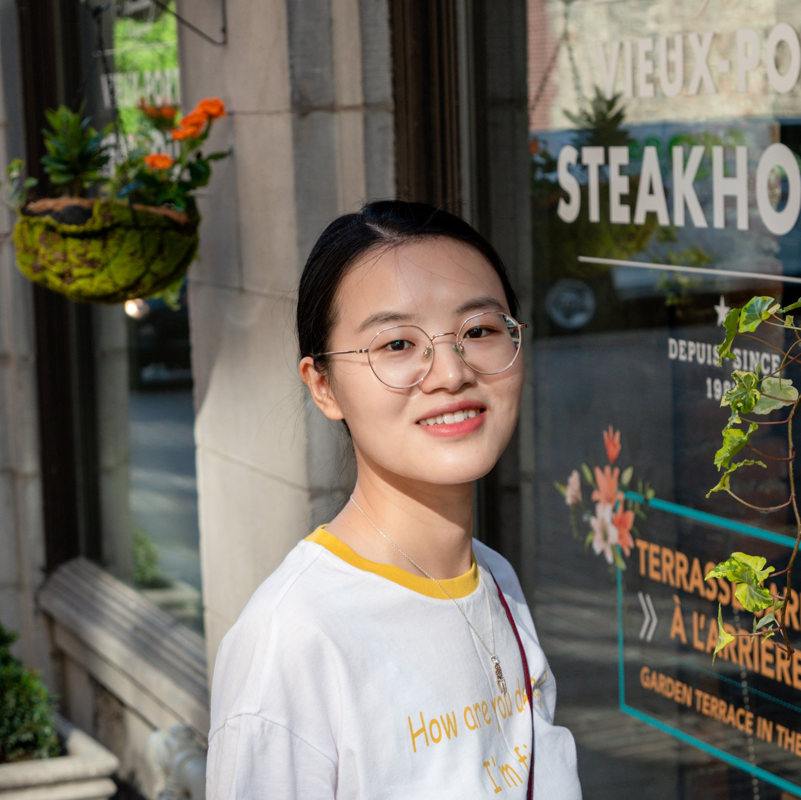

# About me

<figure class="right">
  
  <figcaption>A photo of me taken <a href="https://goo.gl/maps/55mTwwm9Pfy7hUMZ6" target="_blank">here</a></figcaption>
</figure>

Hello, I am Fan Wu (吴帆). I am a PhD student in the department of civil and environmental engineering department at [University of Alberta](https://www.ualberta.ca/), Edmonton, Canada. I am also a member of the [Centre for Smart Transportation (CST)](https://www.ualberta.ca/engineering/research/groups/smart-transportation/) under the supervison by [Dr. Tony Qiu](https://www.ualberta.ca/engineering/research/groups/smart-transportation/people/faculty-and-staff/tony-qiu/). I received my Master degree from [Harbin Institute of Technology](https://www.hit.edu.cn/) and earned a Bachelor degree from [Southeast University](https://www.seu.edu.cn/). 

Now I am working on topics and projects related to yrban mobility under connected automated vehicle environment funded by [NSERC](https://www.nserc-crsng.gc.ca/), [City of Edmonton](https://www.edmonton.ca/), and [Stantec](https://www.stantec.com/en).

# Research interests
My research focuses on addressing efficiency and sustainability issues for urban traffic. I am particularly interested in integrating advances in smart city, intelligent transportation systems, and computer science.
- Smart transportation and urban mobility 
- Sustainable issues for urban transportation
- Reinforcement learning based traffic control

 Welcome to my homepage! If you want to know more about me, feel free to explore [CV](_pages/CV.md) part! 

# News
- 2020-11-08. Created this website.

Found more in [archived news](_posts/2020-11-08-archived-news.md) 

