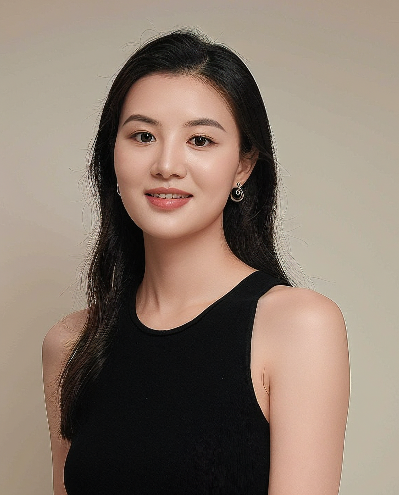

# About me

<figure class="right">
  
  <figcaption>A photo of me powered by AI</figcaption>
</figure>

Hello, I am Fan Wu (吴帆). I am a Postdoctoral Research Fellow in the department of civil and environmental engineering at [University of Alberta](https://www.ualberta.ca/), Edmonton, Canada. I obtained my PhD degree from [University of Alberta](https://www.ualberta.ca/), and I hold a Master's degree from [Harbin Institute of Technology](https://www.hit.edu.cn/) and a Bachelor's degree from [Southeast University](https://www.seu.edu.cn/) in China. 

Currently, I am engaged in research and projects supported by Industrial Research Chair (IRC) Grant from [NSERC](https://www.nserc-crsng.gc.ca/). My work also involves projects collaborating with industry partners such as [TELUS](https://www.telus.com/en), [Stantec](https://www.stantec.com/en), [Acadis IBI Group](https://www.ibigroup.com/), and [ATS Traffic](https://www.atstraffic.ca/). Additionally, I serve as the team leader and coordinator for one of the projects.

<!-- The primary objectives include developing and enhancing a broader range of applications for Vehicle-to-Everything (V2X) technology, thereby improving traffic management efficiency, bolstering safety in mobility, and enhancing the overall travel experience for all participants within the transportation system. -->

# Research interests
My research focuses on addressing efficiency and sustainability issues for urban traffic. I am particularly interested in integrating advances in smart city, intelligent transportation systems, and computer science.
- Smart transportation and urban mobility 
- Sustainable issues for urban transportation
- Reinforcement learning based traffic control
- Traffic automation and electrification

# Contact
Welcome to my homepage! If you want to know more about me, feel free to explore [CV](_pages/CV.md) part! 
- Email: [fwu3@ualberta.ca](mailto:fwu3@ualberta.ca)
- [Google Scholar](https://scholar.google.com/citations?user=5Wl7w1YAAAAJ&hl=en)
- [ResearchGate](https://www.researchgate.net/profile/Fan_Wu33)
- [Linkedin](https://www.linkedin.com/in/fan-wu-lucky/)
- [Github](https://github.com/Lucky-Fan)

# News
- 2024-09-26. I participated in the IEEE ITSC and did two poster presentation and chaired a session.
- 2024-06-20. I participated in the ITS Canada 2024 Annual Conference & Expo and did two poster presentations.
- 2024-01-10. I participated in the TRB annual conference and did the poster presentation.
- 2023-04-25. I am excited and proud to announce I am a recipient of the 2023 Graduate Student Teaching Award.
- 2023-01-09. I participated in the TRB annual conference and did the poster presentation.
- 2022-01-10. I participated in the TRB annual conference and did two poster presentations.
- 2021-02-17. I also win the People's Choice Award for Institute of Transportation Engineers-University of Alberta (ITEUA) Presentation Competition 2021.   
- 2021-02-17. I win the Northern Alberta Section of Canadian Institute of Transportation Engineers (NACITE) Top Graduate (First Place) for ITEUA Presentation Competition 2021.
- 2021-01-25. I participated in the TRB annual conference and did the poster presentation.
- 2020-11-08. Created this website.

Found more in [archived news](_posts/2020-11-08-archived-news.md) 

